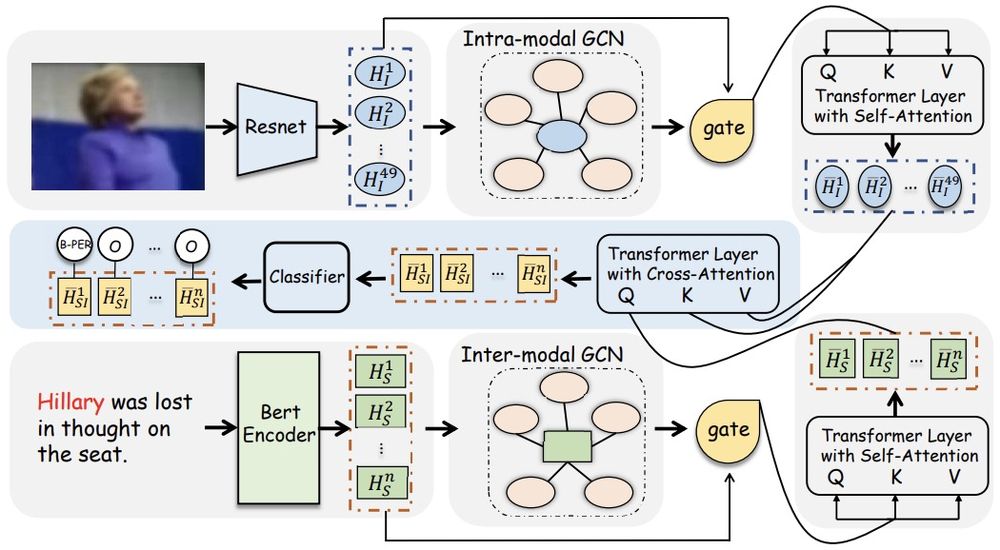

# R-GCN
Code and data for "Learning from Different text-image Pairs: A Relation-enhanced Graph Convolutional Network for Multimodal NER" (ACM MM 2022)

## Overview




- In this paper, we propose to leverage the external matching relations between different (text, image) pairs to improve the performance on the MNER task.

- We design a Relation-enhanced Graph Convolutional Network (R-GCN) to model inter-modal relations and intra-modal relations simultaneously. 

## Setup

### Dependencies

```bash
+ python 3.6
+ tensorflow 1.14.0
+ numpy 1.14.5
```

### Download and preprocess the datasets

Because the image features after processing is very large, you can download them via the link [Baidu Netdist](https://pan.baidu.com/s/1QQHdX2R98F_k7OqtG3upbQ?pwd=0olr). It should be noted that the path of the data is consistent with the file tree.

```sh
├── /data/
│  ├── /twitter2015/
│  │  │  ├── /images2015_feature/	        // the image feature for each image
│  │  │  ├── /twitter2015_images/	        // the original image
│  │  │  ├── /img2img_sim_topk_vec_2015/	// the top-k image feature for each image
│  │  │  ├── /img2text_sim_topk_vec_2015/	// the top-k image feature for each sentence
│  │  ├── train_2.txt
│  │  ├── valid_2.txt
│  │  ├── test_2.txt
│  ├── /twitter2017/
│  │  │  ├── /images2017_feature/
│  │  │  ├── /twitter2017_images/
│  │  │  ├── /img2img_sim_topk_vec_2017/
│  │  │  ├── /img2text_sim_topk_vec_2017/
│  │  ├── train_2.txt
│  │  ├── valid_2.txt
│  │  ├── test_2.txt
```


### Usage

- Train

You can use the folowing command to train R-GCN on the MNER task:

```bash
python trainer.py --config_path=config/tw15_config.json
python trainer.py --config_path=config/tw17_config.json
```

- Test

You can use the folowing command to test R-GCN on the MNER task:

```bash
python test.py --config_path=config/tw15_config.json
python test.py --config_path=config/tw17_config.json
```


## Citation

If the code is used in your research, please cite our paper.